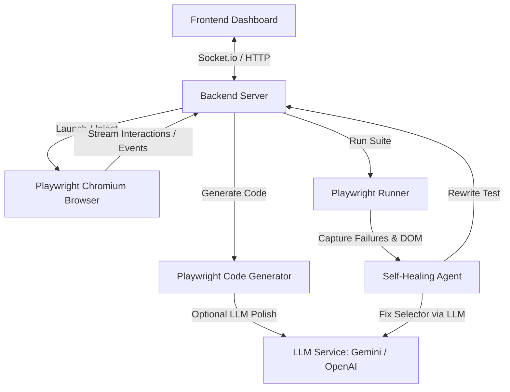

# E2E Testing Agent: Autonomous Playwright Test Builder & Maintainer (TypeScript)

An autonomous, web-based agent that enables users to write and maintain Playwright tests by recording their interactive browser sessions and auto-healing failing tests using LLMs. Built using TypeScript.

---

## Architecture Overview

The application will run locally as a Node.js-based application consisting of:
1. **Frontend (Vite + React + TypeScript)**: A premium, dark-themed dashboard. It contains an interactive recording controller, a custom test manager, a live terminal output stream, a modern Monaco-like code editor, and self-healing visualization.
2. **Backend (Node.js Express + Socket.io + TypeScript)**: Launches target browser instances, injects user action listeners, records page interactions, complies actions into clean Playwright tests, runs test suites programmatically, and runs the LLM Self-Healing loop on test failures.



---

## Core Features

### 1. Interactive Session Recorder
- **Headful Interaction**: Launches a standard Chrome browser instance controlled by Playwright.
- **Event Interception**: Injects an event recorder script that tracks:
  - Navigations and URL changes.
  - Click, input (fill), select, keypress, and form submit events.
  - Scroll position changes.
- **On-Page Assertion Helper**: Injects a floating recording panel directly into the target page. The user can click:
  - **"Assert Visible"**: Highlights hovered elements. Clicking an element generates an assertion like `await expect(page.locator(...)).toBeVisible()`.
  - **"Assert Text"**: Extracts the text of the clicked element and asserts its content: `await expect(page.locator(...)).toHaveText(...)`.
  - **"Stop Recording"**: Ends the session and closes the browser safely.

### 2. Intelligent Code Generator
- **Action Compiler**: Converts raw JSON event logs to basic Playwright action scripts in TypeScript.
- **LLM Refiner**: Sends the compiled sequence to Google Gemini or OpenAI to structure, add comments, clean up selectors (preferring accessible roles, e.g., `getByRole('button', { name: 'Submit' })`), and optimize execution speed.

### 3. Execution Runner & Visualizer
- Runs test suites programmatically.
- Streams terminal logs in real-time to the frontend.
- Captures test results, including errors, trace logs, and screenshots of failed tests.

### 4. Autonomous Self-Healing Agent
- When a test fails:
  1. The healer extracts the failure message (e.g. `locator.click: Timeout exceeded... waiting for locator('button.submit-button')`).
  2. It launches Playwright in headless mode to run the test up to the failed action step.
  3. It extracts the full DOM snapshot or Accessibility Tree of the page at the exact moment of failure.
  4. It sends the failed selector, the error, and the DOM snippet to the LLM (Gemini or OpenAI).
  5. The LLM identifies the target element in the updated DOM, calculates the new selector, and returns it.
  6. The healer updates the test script file automatically and runs the test again to verify it works.
  7. If the test passes, it commits the changes and reports the healed code to the user with a visual diff.

---

## User Review Required

> [!IMPORTANT]
> - **LLM Integration**: To perform LLM-powered test refinement and self-healing, the user will need to configure their Gemini API Key or OpenAI API Key in the settings panel. These keys will be stored locally in a config file (`.env` or `config.json`) and never transmitted elsewhere.
> - **Browser Permissions**: The recorder will open a headful Chromium instance on the local computer. This requires the server to run locally, which is typical for developer tools.
> - **Playwright Setup**: The project will configure Playwright locally. The first run will install the necessary Playwright browsers (`npx playwright install`).
> - **TypeScript Configuration**: The project is written in TypeScript for both the backend and frontend, which requires compilation / transpilation via `tsx` or `ts-node` in the backend and Vite in the frontend.
> - **Git Remote**: Every step of the implementation will be committed and pushed to `https://github.com/Eshbanoliver/E2E-Testing-Agent.git` on the `main` branch.

---

## Proposed Changes

We will build the project inside the workspace directory `D:\Futurexwebsites\tehlil projects\E2E Testing Agent`.

### Directory Structure
```
E2E Testing Agent/
├── package.json             # Root package.json (monorepo structure)
├── tsconfig.json            # Base TypeScript configuration
├── README.md                # Complete documentation
├── implementation_plan.md   # Copy of this implementation plan for the repo
├── backend/
│   ├── package.json
│   ├── tsconfig.json
│   ├── src/
│   │   ├── server.ts        # Express & Socket.io server (TS)
│   │   ├── recorder.ts      # Playwright browser controller (TS)
│   │   ├── generator.ts     # Event-to-Playwright compiler (TS)
│   │   ├── runner.ts        # Test execution (TS)
│   │   └── healer.ts        # Self-healing engine (TS)
│   └── tests/               # Directory where recorded Playwright tests are stored
│       └── example.spec.ts  # Default template test
├── frontend/
│   ├── package.json
│   ├── tsconfig.json
│   ├── vite.config.ts
│   ├── index.html
│   └── src/
│       ├── main.tsx
│       ├── App.tsx
│       ├── index.css        # Premium dark glassmorphism styling
│       ├── types.ts         # Shared interface and type definitions
│       └── components/
│           ├── Dashboard.tsx
│           ├── Recorder.tsx
│           ├── TestEditor.tsx
│           ├── TestRunner.tsx
│           └── Settings.tsx
```

---

## Git Push Workflow
- For every complete step / feature implemented (e.g., repository init, backend base, recorder, editor, runner, healer, integration), we will run Git commands to:
  1. Add and commit files.
  2. Push to remote `main` branch: `git push -u origin main`.

---

## Detailed Component Specifications

### 1. Injected Recorder Script
The script injected via `page.addInitScript` will:
- Listen to `click`, `change`, `input`, and `submit` events.
- Build robust selectors by scanning accessibility roles and text attributes.
- Render a floating controls panel directly in the target webpage.

### 2. Express Backend (`server.ts` + modules)
- Exposes API endpoints and manages WebSocket notifications.

### 3. Code Generator (`generator.ts`)
- Compiles events to TypeScript Playwright test code and refines them using the LLM.

### 4. Self-Healing Engine (`healer.ts`)
- Programmatically repairs locator mismatches by analyzing page snapshots via LLM.

---

## Design and Aesthetic System

The frontend will use a premium, futuristic dark aesthetic (Cyberpunk / Glassmorphic):
- **Colors**: Deep Obsidian backgrounds (`#0a0b0d`, `#111318`), Electric Neon Blue (`#00f0ff` / `#0088ff`), Acid Green (`#10b981`), Crimson Pink (`#ef4444`).
- **Glassmorphism**: Semitransparent panels with subtle blur, thin borders, and soft shadows.

---

## Verification Plan

### Automated Tests
- Verification script `verify_agent.ts` that runs a mock site and tests the recorder, runner, and healer.

### Manual Verification
- Start the server and client, record a session, review TypeScript generated files, run it, break a locator, trigger the self-healing loop, and observe it automatically repairing the code.
